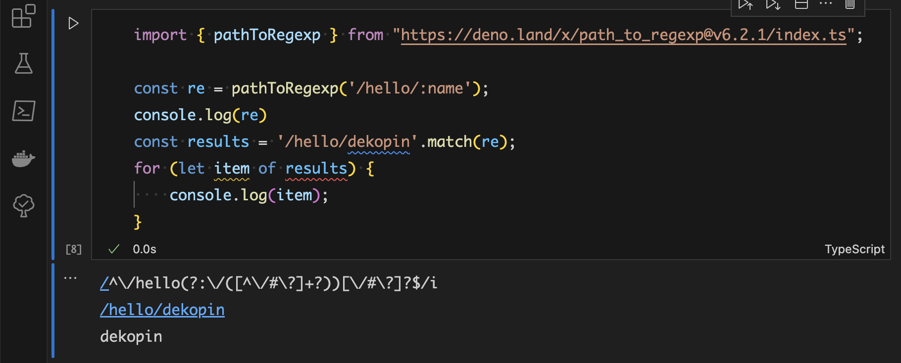

- Table of contents
{:toc}

# JavaScriptのFetch APIを学ぶためにDenoでWebサーバを作った話 --- VSCodeでJupyterを使って

ここで説明するコード一式をGitHubで公開しています。

-   [src/chap10/fetch](https://github.com/kazurayam/JavaScriptAtoZ/tree/develop/src/chap10/fetch)

## 動機

わたしは [Deno](https://deno.com/) を触り始めてまだ１ヶ月の初心者です。Denoについて自分用のメモを書こうとおもう。最初に動機を述べる。

第一の動機。わたしは長いあいだJavaScriptをちゃんと学習せず **とりあえず動いた** で立ち止まっていた。2023年12月、わたしは書籍

-   [《改訂３版 JavaScript本格入門》](https://gihyo.jp/book/2023/978-4-297-13288-0)（山田祥寛 著 2023年2月 技術評論社 刊、以下で「本格本」と略記）

を読んだ。この本を読んでJavaScriptをすこし深く学ぶことができた。ただし本格本にひとつ不満があった。《10.4 非同期通信の基本を理解する - Fetch API》のサンプルコードを実行するのにWebサーバを立てる必要があるのだが、本格本はPHP言語によるWebサーバの実装例を紹介していた。残念ながらわたしはPHPがわからない。JavaScriptを学ぶのにPHPも学ばなければならないのはつらい …​ そうだ、[Deno](https://qiita.com/search?q=Deno) があるじゃないか と思った。WebサーバをTypeScriptで書き、クライアントをJavaScriptで書こう。やってみよう。

第二の動機。2023年9月にDeno 1.37がリリースされて、JupyterカーネルとしてDenoが選べるようになった。

-   [Deno 1.37: Modern JavaScript in Jupyter Notebooks](https://deno.com/blog/v1.37)

VS Codeに拡張モジュールをインストールすれば、JupyterでNotebookファイルを作りコードを素早く実行することができるのだが、DenoがJupyterカーネルとして使えるということは、.ipynb ファイルにTypeScriptのコードを書き、Ctrl+Enterで素早く実行して、結果をJupyterのなかで見ることができる。この道具は魅力的だ。Jupyterカーネルとしての Deno を使ってみよう。

## 作業環境を作る

### 前提する環境

わたしのマシンは MacBook Air M1、OSは macOS Sonoma 14.2.1 です。WindowsでもLinuxでも同じことができるはずですが、わたしは検証していません。以下のツールがインストール済みで実行可能であると仮定します。

-   Pythonがインストール済みで、コマンドラインでバージョンを確認できる。

<!-- -->

    $ python --version
    Python 3.11.5

-   Jupyter Notebookがインストール済みで、コマンドラインでバージョンを確認できる。

<!-- -->

    $ jupyter --version
    Selected Jupyter core packages...
    IPython          : 8.18.1
    ipykernel        : 6.27.1
    ipywidgets       : not installed
    jupyter_client   : 8.6.0
    jupyter_core     : 5.5.0
    jupyter_server   : 2.12.0
    jupyterlab       : 4.0.9
    nbclient         : 0.9.0
    nbconvert        : 7.12.0
    nbformat         : 5.9.2
    notebook         : 7.0.6
    qtconsole        : not installed
    traitlets        : 5.13.0

-   Microsoft Visual Studio Codeがインストール済みで起動できる。

-   VSCodeに [Jupyter拡張](https://marketplace.visualstudio.com/items?itemName=ms-toolsai.jupyter)がインストール済み

この環境をあなたがすでに持っている前提します。つまり、あなたが自分のマシンでVSCodeを起動し、ファイル名拡張子が `.ipynb` であるNotebookファイルを作りダブルクリックすればJupyterで開く、JupyterセルにPythonコードをひとつ書いて、Ctrl+EnterすればPythonカーネルによってコードが実行されて、メッセージが表示される。

<figure>

</figure>

この環境をどうやって作ればいいのか？検索すれば参考になる記事がたくさんある。Qiitaとかをそちらを参考にしてください。

### Denoの本体をインストールする

Denoの本家サイト [deno.com](https://deno.com/) にインストール方法が説明されているのでそれに従ってDenoをインストールします。わたしはMacなのでHomebrewでやりました。

    $ brew install deno

コマンドラインで `deno` コマンドが使えるようになるはずです。確かめましょう。

    $ deno --version
    deno 1.39.1 (release, aarch64-apple-darwin)
    v8 12.0.267.8
    typescript 5.3.3

JupyterでDenoを使うにはdeno 1.37以降が必要です。

### VSCodeにDeno Extensionをインストールする

VSCodeのなかでTypeScriptコードをDenoで実行したい。そのためにはVSCodeに拡張をインストールする必要があります。ドキュメントはこちら:

-   [Deno - Visual Studio Marketplace](https://marketplace.visualstudio.com/items?itemName=denoland.vscode-deno)

使い方がこのように説明されている。

    # Usage
    1. Install the Deno CLI.
    2. Install this extension.
    3. Ensure deno is available in the environment path, or set its path via the deno.path setting in VSCode.
    4. Open the VS Code command palette with Ctrl+Shift+P, and run the Deno: Initialize Workspace Configuration command.

項番4として "run the Deno: Initialize Workspace Configuraiton Command" と書いてあるがこれでは何のことやら。すこし先にこう書いてある。

> We recognize that not every TypeScript/JavaScript project that you might work on in VSCode uses Deno — therefore, by default, this extension will only apply the Deno language server when the setting deno.enable is set to true. This can be done via editing the settings or using the command Deno: Initialize Workspace Configuration.
>
> While you can enable Deno globally, you probably only want to do that if every JavaScript/TypeScript workspace you work on in VSCode is a Deno based one.

つまり、TypeScript含むプロジェクトをVSCodeで開いたとき、そのプロジェクトにおいてあなたがDenoを使うとはかぎらない、とDeno Extensionの開発者は考えた。だからDeno ExtensionをVSCodeにインストールしただけではVSCodeとDenoとは連携しない。VSCodeのSettingsを開き Workspaceの `deno.enable` を `true` にする必要がある。これをやってはじめてVSCodeとDenoの連携が有効化される。

<figure>

</figure>

### Jupyterと連携するためのモジュールをDenoに追加する

以上でVSCodeのなかでDenoを使えるようになった。さらに一歩進もう。VSCodeの中で動くJupyterがDenoをカーネルの一つとして使えるようにしたい。そのためにはDenoに拡張モジュールを追加する必要がある。わたしはこうやりました。

    $ deno jupyter --unstable --install

下記のQiita記事を参考にしました。

-   [Denoで動かすJupyterプロジェクト](https://qiita.com/KokiSakano/items/60c53a1b1b113d3711c2)(Qiita, @KokiSakano)

## 最初の一歩: VSCodeのなかでJupyterでTypeScriptコードを書きDenoで実行しよう

VSCodeでJupyterを開きNotebookファイルをひとつ作ろう。そこにごく短いTypeScriptコードを書こう。そのコードをDenoで実行して結果を見よう。以下、手順を説明する。

VSCodeを起動し適当なフォルダを開く。そこにNotebookを作る。ファイル名はなんでもいいのだがここでは `test.ipynb` としよう。`ipynb` ファイルをダブルクリックするとJupyterが立ち上がり、Notebookを編集可能な状態になる。

セルにTypeScriptコードを入力しよう。なんでもいいのだがここでは

    console.log("Hello, world!");

と入力したとする。すると次のような画面になるだろう。

上のスクリーンショットをみると、JupyterがこのNotebookのためにPythonのカーネルを採用していることがわかる。また `console.log(…​)` というコードをPythonのコードだと認識している、ということがわかる。これではまずい。JupyterがこのNotebookのためにDenoをカーネルとして採用するよう変更することが必要だ。どうすればいいのか？以下に手順を示す。

現状このNotebookが採用しているカーネル名が表示されている箇所をマウスでクリックするとドロップダウンが開く。このドロップダウンのなかに Select Another Kernel…​ というメニューが現れるはずだ。

Select Another Kernel…​を選択するとさらに次のドロップダウンが開く。Jupyter Kernel…​ を選択しよう。

次のドロップダウンが開き、そのなかに Deno が現れるはずだ。

Denoをカーネルとして選択しよう。すると `console.log(…​)` というコードがPythonではなくてTypeScriptとして認識された。

このセルをマウスで選択して Ctrl+Enter しよう。コードが実行されて

    Hello, world!

と表示されるはずだ。こんなふうに。

できた！

以上で、VSCodeのなかでJupyterを動かし、TypeScriptのコードを書き、Denoカーネルで実行できるようになった。

## TypeScriptで素朴なWebサーバを書こう

わたしが何をしたいかというと、[《改訂３版 JavaScript本格入門》](https://gihyo.jp/book/2023/978-4-297-13288-0)（山田祥寛 著 2023年2月 技術評論社 刊、以下で「本格本」と略記）の《10.4 非同期通信の基本を理解する - Fetch API》に掲載されたHTTPクライアントとしてのJavaScriptを実行するのに必要なWebサーバを自分で書きたい。Denoで動かしたい。HTTPリクエストのURLとパラメータを解析し適切なファイルを選んで応答できればいい。どういうコードを書けばいいのだろう？元ネタはないかしら？とネットで漁ったら、この記事を見つけた。

-   [Native Router in Deno](https://medium.com/deno-the-complete-reference/native-router-in-deno-16595970daae)

ぴったりだった。この記事もとづきWebサーバを自作した。コードが全部で１５０行程度と短く初心者のわたしでも理解できる。これを以下で説明する。

### ソースコードのありか

ここで説明するコード一式をGitHubで公開しています。

-   [src/chap10/fetch](https://github.com/kazurayam/JavaScriptAtoZ/tree/develop/src/chap10/fetch)

<!-- -->

    $ tree .
    .
    ├── app.ts
    ├── appstart.sh
    ├── apptest.ipynb
    ├── book.json
    ├── ...
    ├── fetch_basic.html
    ├── ...
    ├── index.html
    ├── native-router
    │   └── mod.ts
    ├── scripts
    │   ├── ...
    │   ├── fetch_basic.js

### 最初の一歩

VSCodeで `src/chap10/fetch/apptest.ipynb` を開きます。このファイルはJupyterのNotebookファイルです。`Simplest Request and Response` と題したセルのあたりに下記のTypeScriptコードがあります。

    const response = await fetch("http://localhost:3000/hello");
    if (response.status === 200) {
        const text = await response.text();
        console.log(text);
    } else {
        console.log(response);
    }

Fetch APIを介して `http://localhost:3000/` にHTTP GETリクエストをあげる。応答を受けたらHTTPステータスを調べる。ステータスが200正常ならば、応答のボディ部分のテキストをconsoleに表示する。ステータスが200正常でなかったらResponseオブジェクトそのままconsoleに表示する。コードのセルを選択した状態でCTRLとENTERキーを同時に押そう。JupyterがコードをDenoに渡す。コードが実行される。Webサーバが応答を返すはずだ。

おっと、エラーになりました。まだWebサーバを立ち上げていなかったから。

Webサーバを起動しましょう。VSCodeのTerminalウインドウを開き、`src/chap10/fetch` ディレクトリにcdします。そして シェルスクリプト `appstart.sh` を実行します。

    $ cd <プロジェクトのディレクトリ>/src/chap10/fetch
    $ ./appstart.sh

シェルスクリプトの中身は一行だけで、TypeScirpt ファイル `app.ts` を `deno` で実行しています。

    deno run --allow-net --allow-read --allow-write --allow-env app.ts

今度は、Webサーバが "Hello" と応答してくれました。

Webサーバをどうやって停止するか？ `./appstart.sh` を実行したのと同じTerminalウインドウで CTRLキーとCキーを押下してプロセスをkillします。

### Webサーバのソースコードを読む

`http://localhost:3000/hello` をGETするHTTPリクエストに応答したのはTypeスクリプト `app.ts` の下記の部分です。

    // https://medium.com/deno-the-complete-reference/native-router-in-deno-16595970daae
    import { Router } from "./native-router/mod.ts";
    import { serve } from "https://deno.land/std/http/mod.ts";

    const router = new Router();

    router.get("/hello", async (req: Request, params: Record<string, string>) => {
        let text = 'Hello';
        const u = new URL(req.url);
        const name = u.searchParams.get('name');
        if (name !== null) {
            text = `Hello, ${name}!`
        }
        return new Response(text, 
                            { headers:{"Content-Type": "text/plain; charset=utf-8"}});
    });

    async function reqHandler(req: Request) {
        console.log(`\n[serve.ts#reqHandler] Request:  ${req.method} ${req.url}`);
        return await router.route(req);
    }
    serve(reqHandler, { port: 3000 });

`"/hello"` というURLPatternにマッチするHTTPリクエストがWebサーバに到来したら `Hello` というメッセージを応答する、ただそれだけのことをしています。

#### Native Routerライブラリ in Deno

`app.ts` は `./native-router/mod.ts` というコードをimportして利用しています。このコードは下記のサイトからダウンロードしました。

-   <https://deno.land/x/nativerouter@1.0.0>

記事 ["Native Router in Deno"](https://medium.com/deno-the-complete-reference/native-router-in-deno-16595970daae)がnative-routerライブラリについて解説しています。わたしはこの記事を読み `./native-router/mod.ts` を使って `app.ts` を書きました。

以下、`app.ts` の中身をユースケース毎に分けて説明していきます。

#### パラメータつきGETリクエストに応答するケース

-   クライアント `apptest.ipynb` のコード

<!-- -->

    const response = await fetch("http://localhost:3000/hello?name=decoy");
    if (response.status === 200) {
        const text = await response.text();
        console.log(text);
    } else {
        console.log(response);
    }

このTypeScriptコードはFetch APIを使ってHTTP GETリクエストを投げます。URLのなかにクエリー文字列 `?name=decopy` が埋め込まれていることに注意。これを実行すると下記のメッセージが表示される。

    Hello, decoy

このリクエストに応答するのはWebサーバの下記のコードです。

-   Webサーバ `app.ts` のコード

<!-- -->

    router.get("/hello", async (req: Request, params: Record<string, string>) => {
        let text = 'Hello';
        const u = new URL(req.url);
        const name = u.searchParams.get('name');
        if (name !== null) {
            text = `Hello, ${name}!`
        }
        return new Response(text, 
                            { headers:{"Content-Type": "text/plain; charset=utf-8"}});
    });

RequestのなかにURLクエリーつまり `?name=値` の形で埋め込まれた値を取り出しています。まずURL文字列を [`URL`](https://deno.land/api@v1.39.1?s=URL) に変換する。URLクエリーが `searchParams` プロパティに変換されているので、そのなかから `name` プロパティの値を取り出す。

### パラメータつきPOSTリクエストに応答するケース

-   クライアント `apptest.ipynb` のコード

<!-- -->

    const formData = new FormData();
    formData.set('name', 'Ippei');
    const response = await fetch("http://localhost:3000/hello", {
        method: 'POST',
        body: formData,
    })
    if (response.status === 200) {
        const text = await response.text();
        console.log(text);
    } else {
        console.log(response);
    }

このTypeScriptコードはHTTP POSTリクエストを投げます。リクエストのbodyのなかにFormデータとして `name` パラメータと値 `Ippei` を渡しています。これを実行すると下記のメッセージが表示される。

    Hello, Ippei

このリクエストに応答するのはWebサーバの下記のコードです。

-   Webサーバ `app.ts` のコード

<!-- -->

    router.post("/hello", async (req: Request, params: Record<string, string>) => {
        let text = 'Hello';
        const formData = await req.formData();
        const name = formData.get('name');
        if (name !== '') {
            text = `Hello, ${formData.get('name')}`;
        }
        return new Response(text, 
                            { headers: {"Content-Type": "text/plain; charset=utf-8"}});
    });

RequestオブジェクトのなかからFormデータを読み出し、`name` パラメータの値 `Ippei` を取り出しています。サーバが受けたRequestオブジェクトを処理するやり方については下記のドキュメントが参考になります。

-   [Deno Runtime API / HTTP Server API / Inspecting the incoming request](https://docs.deno.com/runtime/manual/runtime/http_server_apis#inspecting-the-incoming-request)

### URLのPathがパラメータ化されているリクエストに応答するケース

-   クライアント `apptest.ipynb` のコード

<!-- -->

    const response = await fetch("http://localhost:3000/hello/dekopin");
    if (response.status === 200) {
        const text = await response.text();
        console.log(text);
    } else {
        console.log(response);
    }

このTypeScriptコードはURLパス `/hello/dekopin` にたいしてHTTP GETリクエストを投げます。これを実行すると下記のメッセージが表示される。

    Hello, dekopin

URLパス `/hello/dekopin` の二番目の階層にあたる文字列 `dekopin` がパラメータの値として解釈されています。URLパスが `/hello/yoshinobu` ならば、応答はこうなるでしょう。

    Hello, yoshinobu

このリクエストに応答するのはWebサーバの下記のコードです。

-   Webサーバ `app.ts` のコード

<!-- -->

    router.get("/hello/:name", async (req: Request, params: Record<string, string>) => {
        return new Response(`Hello, ${params.name}!`, 
                            { headers: {"content-type": "text/plain; charset=utf-8"}});

Routerクラスは内部においてURLPatternクラスを利用しています。
- [Deno Runtime API / URLPattern](https://deno.land/api@v1.39.1?s=URLPattern)

さらに分け入るならば、URLPatternは path-to-regexp ライブラリを利用しています。
- [GitHub pillarjs / path-to-regexp](https://github.com/pillarjs/path-to-regexp)

path-to-regexpはたとえば `"/hello/:name"` のようなパターン文字列を受け取ってそれと意味的に等価な正規表現を生成します。例を示しましょう。

path-to-regexpが生成されした正規表現を `"/hello/dekopin"` という文字列に適用すれば、パラメータ `name` に該当する値として `dekopin` という文字列が取り出されました。すごく便利ですね。

### HTMLファイルを応答するケース

-   クライアント `apptest.ipynb` のコード

<!-- -->

    const response = await fetch("http://localhost:3000/fetch_basic.html");
    if (response.status === 200) {
        const text = await response.text();
        console.log(text);
    } else {
        console.log(response);
    }

このTypeScriptコードはURLパス `/fetch_basic.html` にたいしてHTTP GETリクエストを投げます。これを実行すると下記のメッセージが表示される。

    <html>
      <head>
        <meta charset="UTF-8" />
        <title>JavaScript本格入門</title>
      </head>
      <body>
        <input id='btn' type="button" value="print message in console"/>
        
      </body>
    </html>

このリクエストに応答するのはWebサーバの下記のコードです。

-   Webサーバ `app.ts` のコード

<!-- -->

    router.get("/:filename.html", async (req: Request, params: Record<string, string>) => {
        const html = await Deno.readTextFile(`${params.filename}.html`);
        return new Response(html, { headers: {"content-type": "text/html; charset=utf-8"}});
    });

`fetch_basic.html` はWebサーバーのディスク上に在るHTMLファイルです。Webサーバはこのファイルをディスクから読み取ってクライアントに応答します。

### JSファイルを応答するケース

### JSONファイルを応答するケース
